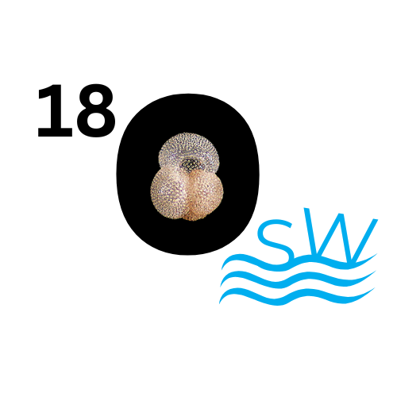

<!-- Set favicon -->
<link rel="icon" type="image/png" href="logo/Palclim.png">

  

   
   AgeD: A tool to build age-depth model of sediment cores 
  

  

   📥 Sample inputs:
   <a class="download-box" href="Trial/osl18/GeoBXXXX.xlsx" download>Sample input</a>
  

  <iframe class="responsive-iframe" src="https://partha679.shinyapps.io/Bacon_onl99/"></iframe>

