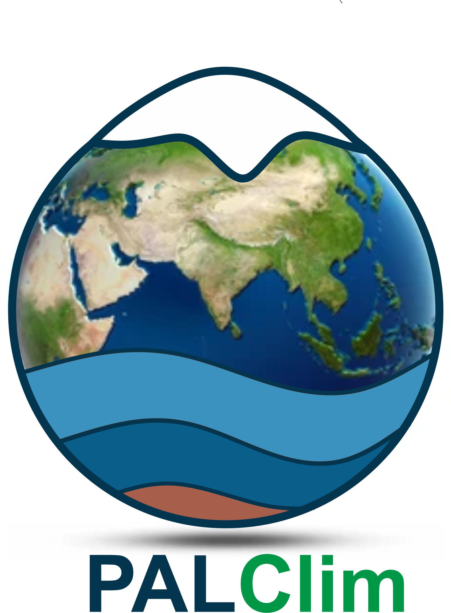

<!-- Set favicon -->
<link rel="icon" type="image/png" href="logo/Palclim.png">

<!-- 🌳 Earthy Background Style -->

<!-- 🌎 Background Elements -->

  

  

  

  

  

<!-- 🚀 Main Section -->

  

   
  

  

   <h1 style="margin: 0; font-size: 40px; font-weight: 700; color: #1a237e;">PALClim</h1>
   
A Platform for Analytical Learning on Climate Interactions 

  

  

    <b>PALClim</b> is a digital initiative focused on developing accessible, browser-based tools for climate and paleoclimate researchers. These tools simplify complex geochemical calculations, facilitate δ18O corrections, visualize proxy datasets, and much more — all without the need for installation or programming expertise.
  

  

    Designed for early-career scientists, educators, and field researchers, PalClim combines robust science with user-friendly interfaces. Whether you're analyzing marine sediment records, interpreting temperature proxies, or teaching isotope geochemistry, PalClim aims to support your work. 
  

  

    The entire platform — including hosting and tool development — is built and maintained by 
    <b>
      <a href="https://www.parthasarathi.info" target="_blank" style="color: #0d47a1; text-decoration: none;">
        Dr. Partha Sarathi Jena
      </a>
    </b>, a postdoctoral researcher at the University of São Paulo, Brazil. Dr. Jena welcomes collaborations on future tool development projects. If you have an idea, feel free to reach out to him. 
  

  

    This website and its services are personally funded by Dr. Jena without any sponsorship. If you find PalClim useful in your research or teaching, you're warmly welcome to support its development and future tools. If you know Dr. Jena personally, you may contact him directly for donations. 
  

<!-- Ko-fi Floating Donate Button -->

<!-- PayPal.me Button with Logo -->

