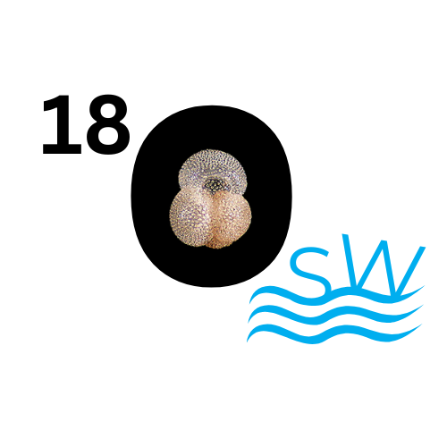

<!-- Set favicon -->
<link rel="icon" type="image/png" href="logo/Palclim.png">

  

   
   δ18O-SW: A tool to calculate δ18O-Sea water from δ18O-Calcite 
  

  

   📥 Sample inputs:
   <a class="download-box" href="Trial/osl18/d18o.xlsx" download>Age–δ18O</a>
   <a class="download-box" href="Trial/osl18/SSL.xlsx" download>Age–Sea Level</a>
   <a class="download-box" href="Trial/osl18/temp.xlsx" download>Age–Temperature</a>
  

</style>

  <iframe class="responsive-iframe" src="https://partha679.shinyapps.io/18osl/"></iframe>

